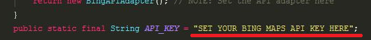
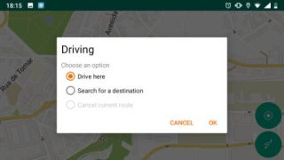
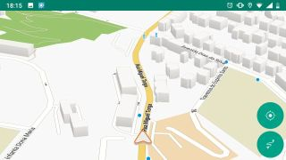
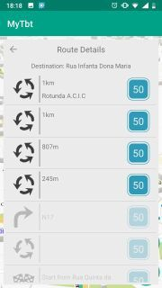

# Turn-by-Turn Navigation Module for Android
#### A turn-by-turn navigation module to integrate GPS navigation in Android apps

## Setting up
### Set your Bing Maps API key (optional)
If you want to use Bing's routing API, please set your API key in the NavConfig.class.
You may build your own adapter for your desired routing API as well.

### Use the provided maps
As an example, a map of Portugal is provided. You can find the map and graph files under \Maps
To use them, copy all the files in the \Maps\Portugal folder to the download\TbtModuleMaps\Portugal folder in your device (if there is no TbTModuleMaps folder in your device, create it).

Please note that the Portugal.map file size is too large, so it is compressed. Please unzip it before using.

### Prepare and use your own maps
I created a script to prepare map files automatically. The script, as well as some instructions to prepare the maps manually are provided in the project's \Maps folder.

## Using
Start the app and, in overview mode, longpress the map itself until the drive promp appears. Choose one of the options to start driving:

Change to turn-by-turn mode if you want:

You can view a list of the instructions any time you are navigating by pressing the navigation bar in turn-by-turn mode:

## History and goal
This project was developed from a navigation proof of concept I created for a larger comercial project during an internship. After the intership, I asked the company if I could do whatever I wanted with the code I developed, and they accepted. So I used it as a learning opportunity and (hopefully) created a turn-by-turn navigation module for Android applications, which anybody can use and improve.

The goal is to develop a free open-source turn-by-turn navigation alternative which can be integrated in any Android application.

## Key features
- May work enterely offline
    The system is prepared to work enterely offline, if required
- Tries to use as little mobile data as possible
    Since the core part of the navigation functionality was developed for another application, it is bound to some of the requirements defined for that app
    That is why the routing system tries to use as little mobile data as possible, by performing most route adjustments offline using the Graphhopper library
- The routing system was developed to use Adapters, so you can make your own adapter dor any Routing API
- If online, the system has the potential to display traffic information on the map

## Used Libraries
[GraphHopper for Android](https://github.com/graphhopper/graphhopper)
    
[OpenScienceMaps for Android](https://github.com/opensciencemap/vtm)

[GraphHopper and Vtm project](https://github.com/graphhopper/graphhopper/tree/master/android)
